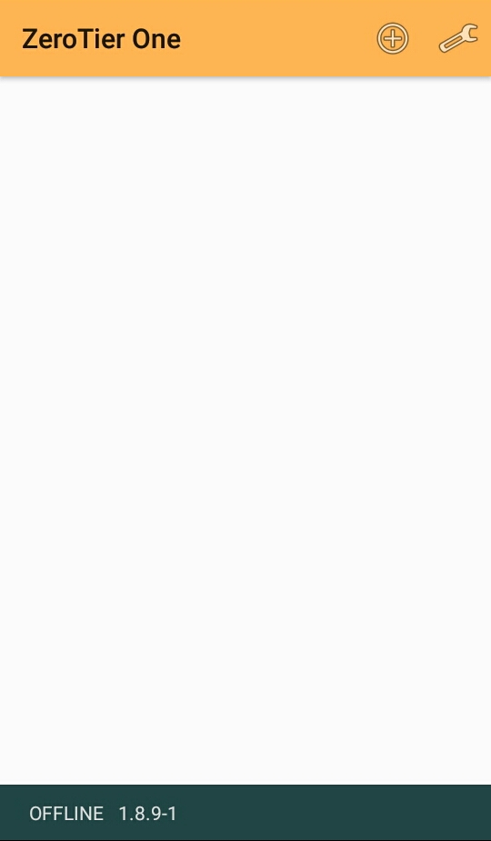
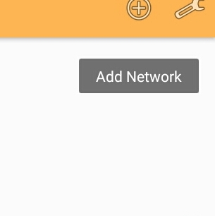
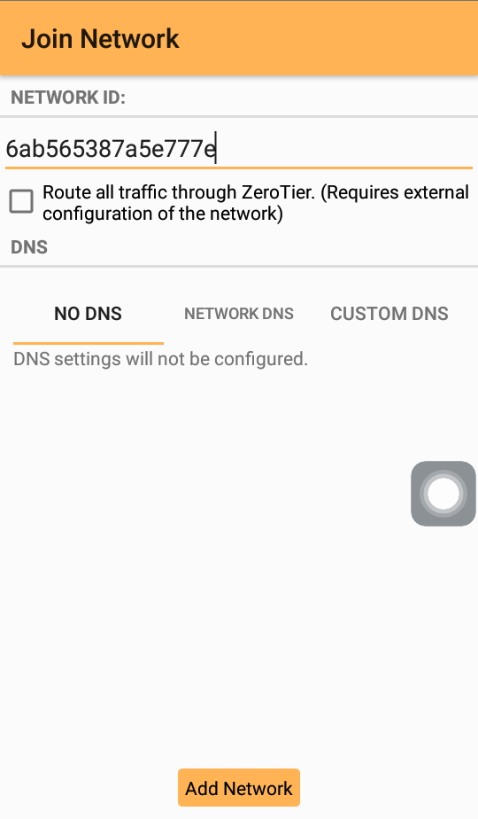
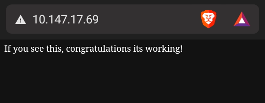

<!---
Arrangement should look like this:
Open message
Prerequisites
 Android platform:
  Installing Zerotier One app
  Configuring to connect
  Testing
  Connecting to server
  TroubleShooting
 Windows (Java): Todo.
 Windows (Bedrock): Todo.
Closing message
-->

Hello fellow member! In order to join our Minecraft SMP it is required to use a third party application. Due to limited resources to host the server it is an requirement. This guide aims to make the process painless and and a pointer to ease joining next session.

# Prerequisites

• Minecraft version `1.19.2` 

• A decent internet

• An Android phone or a Windows PC (Both Java And Bedrock players can join)

• Cooperation with an admin

• A good common sense

# Sections

> For Java players. Jump to this [section]()

> For Bedrock players. Jump to this [section]()

> For Mobile players. Jump to this [section](#Android)

> For troubleshooting. Jump to this [section]()
# Android
### Downloading Zerotier
You can download Zerotier One app [here](https://play.google.com/store/apps/details?id=com.zerotier.one).
It is completely safe to download as its downloadable in Play Store.

### First setup
1. Once installed, you will be greeted with this screen

2. Click this button in order to add network

3. Copy `6ab565387a5e777e` and paste to Network ID textbox, like in this image

4. Click "Add Network"

5. After doing it you will return in first screen, few moments this toast will appear

**Contact the Admins in order to get Authorized.**

6. If the admins tell you you're now authorized you must visit http://10.147.17.69 which is the IP Address for the Server.
You should be greeted with this

Or if something fails. You will get this instead:

> You may either contact the admins or visit [Troubleshoot](link.here) section.

7. In Servers inside Minecraft, input `10.147.17.69` as IP and `19132` for port. And enjoy!
